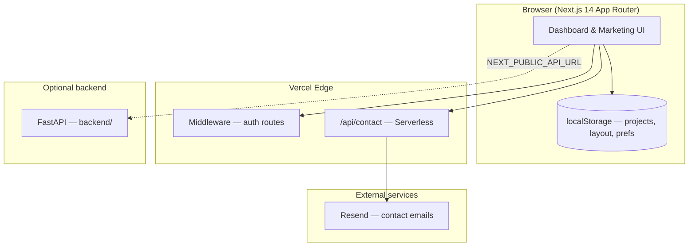

<div align="center">

# 4CHGM — Managing Change

**AI-Powered Enterprise Operating System for Organizational Transformation**

[](https://nextjs.org)
[](https://www.typescriptlang.org)
[](https://react.dev)
[](https://vercel.com)
[](LICENSE)

*Cinematic enterprise UX · Role-based workspaces · Live portfolio intelligence · AI copilot*

[Live Demo](#) · [Documentation](#-déploiement-vercel) · [Report Bug](https://github.com/MEVENGUE/4chgm-enterprise-os/issues)

</div>

---

## Vision

**4CHGM** is a believable premium SaaS platform for **change management at scale** — the kind of product a funded startup would ship on day one.

It unifies transformation strategy, agile delivery, risk governance, cost forecasting, and AI-assisted decision-making into a single cinematic interface. Dark and light themes, six languages, and role-based dashboards make it feel like opening a **futuristic enterprise AI operating system**.

> Built by [Franck Mevengue](https://www.linkedin.com/in/franck-mevengue-839028207/) — Cloud Architecture & DevOps student at SUPINFO Paris.

---

## Highlights

| Capability | Description |
|---|---|
| **Cinematic login** | Neural globe (R3F), floating AI insight cards, ambient engine, glassmorphism |
| **Role workspaces** | Executive · Engineering · Transformation · Finance — RBAC-aware navigation |
| **Live intelligence** | Portfolio changes propagate to analytics, risks, roadmap, notifications |
| **AI Copilot** | Streaming chat, citations, artifacts, knowledge retrieval (mock → vector-ready) |
| **Knowledge Center** | Enterprise docs, playbooks, semantic search, AI recommendations |
| **Executive reports** | AI-generated summaries + export architecture |
| **Dashboard personalization** | Drag-and-drop widgets per workspace (`dnd-kit`) |
| **i18n** | EN · FR · DE · ZH · JA · RU |
| **Product pages** | About · Contact · Privacy · Terms · Cookies |

---

## Architecture



**Default mode on Vercel:** frontend + mock services in the browser. No external database required. The FastAPI scaffold in `backend/` is optional and deploys separately (Railway, Render, Fly.io…).

---

## Tech Stack

| Layer | Technologies |
|---|---|
| Framework | Next.js 14 · App Router · Middleware |
| Language | TypeScript |
| Styling | Tailwind CSS · CSS design tokens · glass panels |
| Motion | Framer Motion · ambient CSS engine |
| 3D | React Three Fiber · Drei · Three.js |
| Charts | Recharts |
| DnD | dnd-kit |
| Diagrams | Mermaid |
| Email API | Resend (optional) |
| Backend (optional) | FastAPI · Python |

---

## Quick Start

### Prerequisites

- **Node.js** ≥ 18.17
- **npm** ≥ 9

### Local development

```bash
git clone https://github.com/MEVENGUE/4chgm-enterprise-os.git
cd 4chgm-enterprise-os
npm install
cp .env.example .env.local   # optional
npm run dev
```

Open [http://localhost:3000](http://localhost:3000) → redirects to `/login`.

**Demo auth:** any email + password ≥ 4 characters.

### Production build

```bash
npm run build
npm run start
```

---

## Déploiement Vercel

### Option A — Dashboard (recommandé)

1. Va sur [vercel.com/new](https://vercel.com/new)
2. **Import Git Repository** → sélectionne [`MEVENGUE/4chgm-enterprise-os`](https://github.com/MEVENGUE/4chgm-enterprise-os)
3. Vercel détecte **Next.js** automatiquement — ne change rien :
   - **Framework Preset:** Next.js
   - **Build Command:** `npm run build`
   - **Output Directory:** *(laisser vide — auto)*
   - **Install Command:** `npm install`
   - **Node.js Version:** 18.x ou 20.x
4. Ajoute les variables d'environnement (voir tableau ci-dessous)
5. Clique **Deploy**

### Option B — Vercel CLI

```bash
npm i -g vercel
vercel login
vercel link
vercel env pull .env.local   # sync env from Vercel
vercel --prod
```

### Option C — One-click

[](https://vercel.com/new/clone?repository-url=https://github.com/MEVENGUE/4chgm-enterprise-os&env=CONTACT_TO_EMAIL&envDescription=Email%20de%20r%C3%A9ception%20du%20formulaire%20contact&project-name=4chgm-enterprise-os)

---

## Configuration des variables d'environnement

Configure dans **Vercel → Project → Settings → Environment Variables** (Production + Preview + Development).

| Variable | Requis | Description |
|---|---|---|
| `CONTACT_TO_EMAIL` | Recommandé | Email qui reçoit les messages du formulaire contact |
| `RESEND_API_KEY` | Optionnel | Clé API [Resend](https://resend.com) — sans elle, le contact fonctionne en mode mock (log serveur) |
| `CONTACT_FROM_EMAIL` | Optionnel | Expéditeur Resend (ex. `4CHGM <noreply@ton-domaine.com>`) — domaine vérifié requis en prod |
| `NEXT_PUBLIC_API_URL` | Optionnel | URL du backend FastAPI — vide = mock data côté client |
| `NEXT_PUBLIC_APP_URL` | Optionnel | URL publique de l'app (ex. `https://4chgm.vercel.app`) |

Copie locale : `.env.example` → `.env.local`

### Resend — étapes rapides

1. Crée un compte sur [resend.com](https://resend.com)
2. Ajoute et vérifie ton domaine (ou utilise `onboarding@resend.dev` pour les tests)
3. Génère une API key → `RESEND_API_KEY`
4. Redéploie sur Vercel

---

## Déploiement Railway (backend)

Le frontend fonctionne **sans backend** (mock data). Railway sert l'API FastAPI optionnelle.

### Étapes

1. [railway.app](https://railway.app) → **New Project** → **Deploy from GitHub**
2. Repo : `MEVENGUE/4chgm-enterprise-os`
3. **Settings → Root Directory** → `backend` *(obligatoire)*
4. **Variables** :

| Variable | Valeur |
|---|---|
| `CORS_ORIGINS` | URL Vercel de ton frontend, ex. `https://4chgm.vercel.app` |
| `OPENAI_API_KEY` | *(optionnel)* pour l'IA réelle |

5. **Settings → Networking** → **Generate Domain** → copie l'URL publique
6. Dans **Vercel**, ajoute `NEXT_PUBLIC_API_URL` = URL Railway (sans `/` final)
7. Redéploie Vercel

Vérification : `https://ton-api.up.railway.app/health` → `{"status":"ok"}`

Fichiers Railway inclus : `backend/railway.toml`, `backend/Procfile`, `backend/requirements.txt`

---

## Structure du projet

```
4chgm-enterprise-os/
├── src/
│   ├── app/                  # Routes App Router (dashboard, auth, marketing, api)
│   ├── components/
│   │   ├── ambient/          # Cinematic background engine
│   │   ├── 3d/               # NeuralGlobe (R3F)
│   │   ├── cinematic/        # Hero scene, floating cards, parallax
│   │   ├── dashboard/        # Widgets, role-based views
│   │   └── ...
│   ├── lib/                  # Intelligence engine, insights, RBAC, reports
│   ├── providers/            # Auth, theme, i18n, copilot, projects
│   ├── services/             # Mock + API-ready services
│   └── styles/               # Design tokens, theme, ambient CSS
├── backend/                  # FastAPI — Railway (root dir: backend/)
│   ├── railway.toml
│   └── Procfile
├── public/                   # favicon, static assets
├── vercel.json               # Region CDG1 (Paris) + security headers
├── .env.example
└── next.config.js
```

---

## Routes principales

| Route | Accès | Description |
|---|---|---|
| `/login` | Public | Cinematic auth + neural globe |
| `/dashboard` | Auth | Role-based executive dashboard |
| `/dashboard/ai` | Auth | AI Copilot |
| `/dashboard/projects` | Auth | Initiative CRUD (localStorage) |
| `/dashboard/knowledge` | Auth | Knowledge center |
| `/about` | Public | Product & founder story |
| `/contact` | Public | Enterprise contact form |
| `/api/contact` | API | Resend integration |

---

## Scripts

| Command | Action |
|---|---|
| `npm run dev` | Dev server (port 3000) |
| `npm run build` | Production build |
| `npm run start` | Start production server |
| `npm run lint` | ESLint |

---

## Troubleshooting

### Cache `.next` corrompu (Windows)

```powershell
taskkill /F /IM node.exe
Remove-Item -Recurse -Force .next
npm run dev
```

### Build Vercel échoue sur Three.js

Le globe 3D est chargé en `dynamic(..., { ssr: false })`. Si erreur persistante, vérifie Node 18+ dans les settings Vercel.

### Contact form ne envoie pas d'email

Vérifie `RESEND_API_KEY` et que le domaine expéditeur est vérifié sur Resend. Sans clé, la route répond `{ ok: true, mock: true }`.

---

## Roadmap

- [ ] Supabase auth + Postgres persistence
- [ ] Real OAuth (Google / Microsoft)
- [ ] Vector embeddings for knowledge base
- [ ] PDF export (executive reports)
- [ ] Webhook integrations (Jira, SAP, GitHub)

---

## Author

**Franck Mevengue**  
Master Architecture Cloud, Systèmes & Réseaux — SUPINFO Paris

[](https://www.linkedin.com/in/franck-mevengue-839028207/)
[](https://github.com/MEVENGUE)
[](mailto:mevengueengofranck@gmail.com)

---

<div align="center">

**4CHGM — Managing Change** · v0.1.0

*Transform organizations. Ship change. Decide with intelligence.*

</div>
